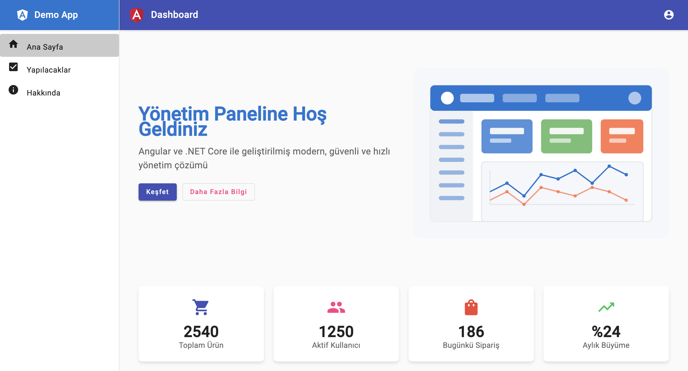

# Angular ve .NET Core Projesi

Bu proje, modern web uygulamaları geliştirmek için Angular frontend ve .NET Core backend kullanılarak oluşturulmuştur.

## Proje Görüntüleri



## Gereksinimler

- Node.js (v18 veya üzeri)
- .NET 8 SDK
- Angular CLI
- Visual Studio 2022 veya Visual Studio Code
- Git

## Proje Yapısı

```
AngularAndCore/
├── Frontend/                 # Angular uygulaması
│   ├── src/
│   ├── package.json
│   └── angular.json
└── Backend/                  # .NET Core Web API
    ├── Controllers/
    ├── Models/
    ├── Services/
    └── Program.cs
```

## Kurulum Adımları

### Backend (.NET Core) Kurulumu

1. Backend klasörüne gidin:
```bash
cd Backend
```

2. Projeyi derleyin:
```bash
dotnet build
```

3. Projeyi çalıştırın:
```bash
dotnet run
```

### Frontend (Angular) Kurulumu

1. Frontend klasörüne gidin:
```bash
cd Frontend
```

2. Bağımlılıkları yükleyin:
```bash
npm install
```

3. Geliştirme sunucusunu başlatın:
```bash
ng serve
```

## API Endpoints

Backend API'si varsayılan olarak `https://localhost:7001` adresinde çalışacaktır.

## Geliştirme İpuçları

1. Backend geliştirmesi için Visual Studio 2022 veya Visual Studio Code kullanabilirsiniz.
2. Frontend geliştirmesi için Angular CLI ve tercih ettiğiniz bir IDE kullanabilirsiniz.
3. API isteklerini test etmek için Swagger UI'ı kullanabilirsiniz (`https://localhost:7001/swagger`).

## Katkıda Bulunma

1. Bu projeyi fork edin
2. Feature branch oluşturun (`git checkout -b feature/amazing-feature`)
3. Değişikliklerinizi commit edin (`git commit -m 'feat: Add some amazing feature'`)
4. Branch'inizi push edin (`git push origin feature/amazing-feature`)
5. Pull Request oluşturun

## Lisans

Bu proje MIT lisansı altında lisanslanmıştır. 